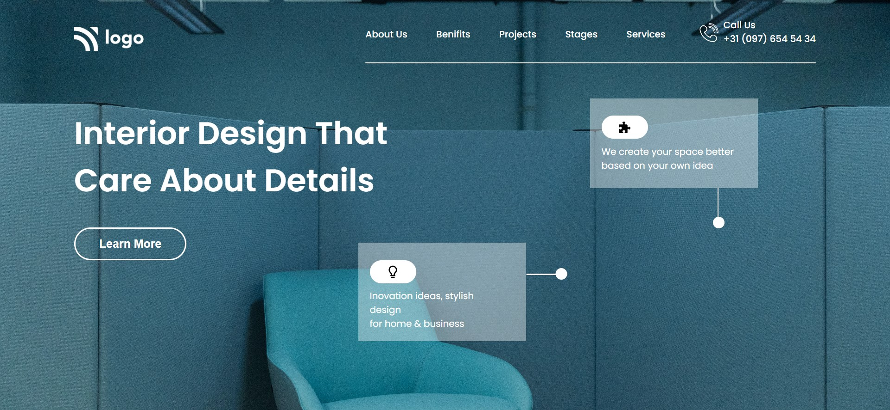

# Assignment 10

 

---

## Project 10 [Live link]()
- Skills Gained in this project
    - Learned about object postions.
    - Learned various flexbox properties.
    - Learned about background image positioning.
    - Learned to write mediaquery for responviveness.
---

## Time taken to finish this project

- 5 hour taken to Finish this project.

Screenshots

